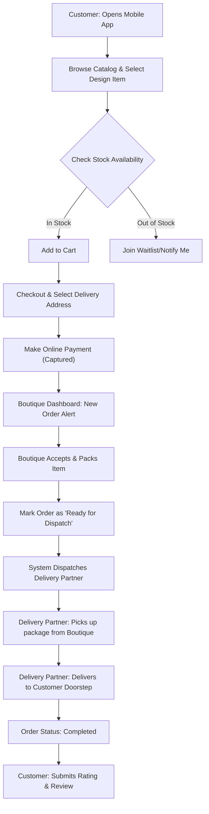
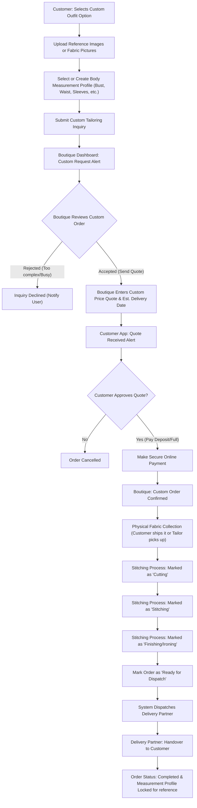
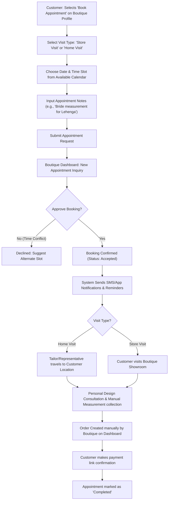
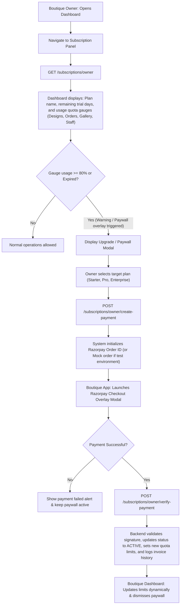
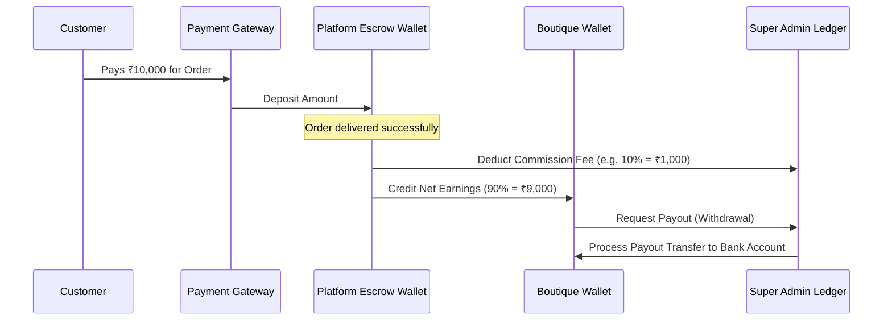

# VS Boutique - Project Architecture, Core Aim, & Workflow Diagrams

This document explains the overarching system architecture, real-world operational flows, customer-to-delivery workflows, and recommendations for future enhancements of the VS Boutique platform.

---

## 1. Project Core Aim
The core aim of **VS Boutique** is to build a **premium, hyper-local fashion discovery and custom-tailoring ecosystem** (modeled after the Zomato/Swiggy convenience model). 

Instead of traditional standard-size e-commerce (like Amazon/Myntra) or disjointed local tailor shops, VS Boutique bridges the gap by providing:
1. **Discovery & Curation**: Customers can browse nearby boutique profiles, portfolios, ratings, and specialties (e.g., Bridal, Indo-Western, Casuals).
2. **The "Virtual Tailor" (Digital Measurement Book)**: Customers store their body measurements digitally once and attach them to any customization request.
3. **Real-Time Order Progress**: Customers track the physical tailoring pipeline (e.g., cutting, stitching, finishing) just like tracking food preparation.
4. **End-to-End Delivery Logistics**: Once the item is designed and stitched, a local delivery partner handles pick-up from the tailor and contactless hand-off to the customer.

---

## 2. Real-World Functionality: Who is Who?

The platform consists of four distinct user roles interacting in a unified database:

```
┌─────────────────┐       ┌──────────────────┐       ┌──────────────────┐       ┌─────────────────┐
│  Customer App   │ ◄───► │  Boutique/Tailor │ ◄───► │ Delivery Partner │ ◄───► │   Super Admin   │
│ (React Native)  │       │  (Owner Web App) │       │   (Delivery App) │       │ (Command Center)│
└─────────────────┘       └──────────────────┘       └──────────────────┘       └─────────────────┘
```

* **Customer**: Browses boutiques, uploads design inspiration, manages multiple body measurement profiles (e.g., "Self", "Sister", "Friend"), places orders, books tailor consultations, and tracks deliveries.
* **Boutique Owner / Tailor**: Manages their storefront profile, sets service specialties, runs local campaigns, accepts custom requests, updates active fabric preparation states (Stitching, Cutting, etc.), and requests payouts.
* **Delivery Partner**: Receives automatic dispatch requests once orders are marked `Ready` by the tailor, collects the packaging, and delivers to the customer's doorstep.
* **Super Admin**: Monitors server/database health, approves new boutique applications, moderates fraudulent reviews, processes payout requests, manages system commission rates, and resolves disputed tickets.

---

## 3. Detailed Workflow Trees

### Case A: Direct Buying of Pre-Designed Products
*Used when a customer buys a ready-to-wear design cataloged by a boutique.*



---

### Case B: Custom Tailoring & Made-to-Measure Design
*Used when a customer wants a custom dress stitched from raw fabric, using a design template or custom uploaded reference images.*



---

### Case C: Booking Tailors & In-Store / Home Appointments
*Used when a customer wants to schedule a personal physical visit for fit checks, custom design discussion, or manual measurement taking.*



---

### Case D: Boutique Subscription & Paywall Modal Workflow
*Used when a boutique owner views their subscription details, upgrades their quota, or handles renewals.*



---

## 4. Financial & Payout Settlement Cycle

Every payment flows through a split-settlement system:



---

## 5. Technical Pipeline Status
* **Backend Database Models**: [100% Complete] Database relations (Users, Boutiques, Bookings, Orders, Payments, Payouts, AuditLogs) mapped via Prisma schemas to Neon Postgres.
* **Server Layer**: [98% Complete] REST APIs equipped with JSON loggers, JWT auth guards, performance benchmarks, and error handling.
* **Admin Panel**: [95% Complete] Command Center screen with live health monitoring, audit streams, and metrics charts.
* **Client Apps**: [85-90% Complete] Navigation, dashboard views, custom cart pipelines, and measurement guides.

---

## 6. Key Enhancements to Improve the Customer Experience

To transition VS Boutique from a basic marketplace to a state-of-the-art customer experience, the following enhancements are highly recommended for implementation:

### 1. Automated Fabric Logistics (Pickup & Delivery Integration)
* **Problem**: In Custom Tailoring (Case B), the customer has to figure out how to physically get their raw fabric to the tailor, which adds high friction.
* **Solution**: Integrate a local courier API (e.g., Dunzo, Porter, Uber Connect, or Shadowfax) directly in the checkout flow.
* **Workflow**:
  1. Once payment is made, a delivery request is automatically generated.
  2. A courier partner picks up the raw fabric from the customer's house and drops it at the boutique.
  3. The status is tracked inside the app as `Fabric Picked Up` $\rightarrow$ `Fabric Delivered to Tailor`.

### 2. Milestone Photo-Proofing & Live Chat
* **Problem**: Customers often feel anxious about whether the custom dress is being stitched according to their expectations, and tailors have no easy way to get quick confirmations.
* **Solution**: Enable a milestone photo upload feature in the owner dashboard and an in-app chat.
* **Workflow**:
  1. When the tailor marks the status as `Stitch Completed`, they are prompted to take a photo of the garment on a mannequin and upload it.
  2. The customer reviews it. If it looks correct, they click "Approve for Shipping". If not, they can request minor alterations via direct in-app chat before dispatch.

### 3. Smart Camera Measurements (AI Virtual Tape Measure)
* **Problem**: Customers find it tedious and error-prone to manually measure their body with a physical tape measure.
* **Solution**: Implement a mobile-guided camera feature or custom estimation algorithm.
* **Workflow**:
  1. The app guides the user to take front and side profile photos.
  2. A lightweight computer vision SDK estimates body contours to suggest the primary measurements (Bust, Waist, Hip, Height).
  3. Suggest standard tailoring size presets based on their standard retail apparel size (e.g. Zara Medium matches certain measurement bounds).

### 4. Interactive 3D Avatar Preview (Virtual Try-on)
* **Problem**: Customers struggle to visualize how a fabric color or neck design looks in 3D.
* **Solution**: Add a WebGL/Three.js-based 3D customizable avatar.
* **Workflow**:
  1. Customers input their height and bust size.
  2. The avatar updates its dimensions.
  3. The user can overlay selected designs (e.g. V-neck vs Round-neck) and change the color or texture pattern, minimizing fit disputes and buyer remorse.

### 5. Tailor CRM & Automatic Retention Notifications
* **Problem**: Tailors lose track of repeat customers who have stored measurements.
* **Solution**: Add boutique owner dashboards with automated campaign triggers.
* **Workflow**:
  1. The system detects when a customer has a saved measurement profile that has not been updated in 12 months.
  2. It prompts the boutique owner to send a customized WhatsApp or app push notification: *"Hi Sanjana, it's been a year since we stitched your last Lehenga! Would you like to schedule a quick home visit to update your measurements for the upcoming wedding season?"*
